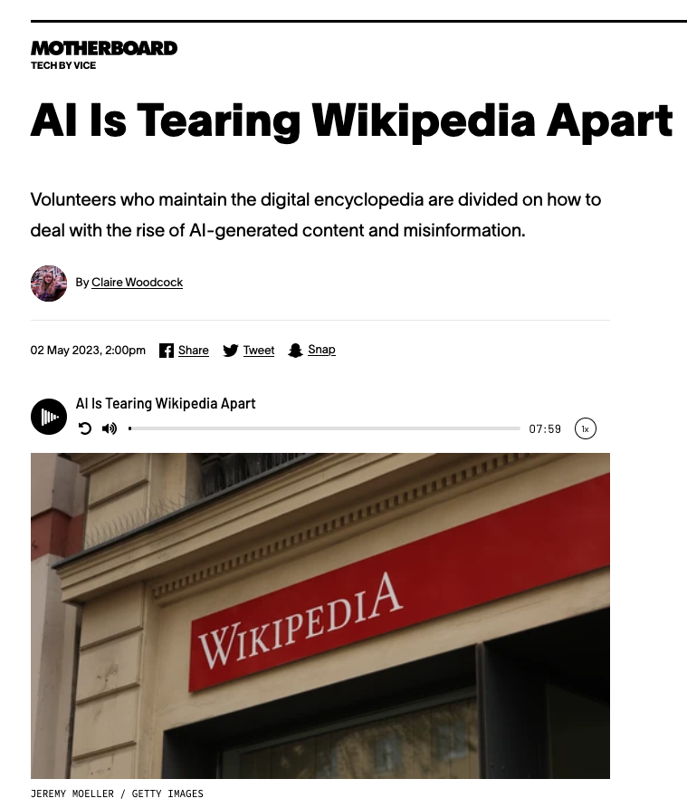

## Hello World Demo & Best Practices
We'll begin with a simple 'Hello World' demo using **ChatGPT**. The demo will cover best practices, one of which is to avoid prompt injection. For example, user input should be delimited using three backticks to prevent bypassing input guardrails.

## Understanding GPT's Knowledge
You may wonder, if ChatGPT 4 isn't aware of GPT 4, how can it reveal confidential information? The explanation lies in the **human feedback model**, a layer of reinforced learning on top of ChatGPT. This model refines the output, not by having your code, but by imitating the patterns in your code due to developer training.

## Data Supply Chain Security
As we use generative AI for creating synthetic images and content, there's an increased risk of copyright infringement. It's essential for AI companies to carefully curate data and ensure all generated content is properly licensed. Consumers should also have contractual agreements to use such data.

## Embeddings: Extending Model Knowledge
Embeddings allow us to extend the knowledge of an already trained model with external datasets, a process that doesn't require retraining the model. Key to this process is ensuring safe practices, including having data agreements and using secure cloud instances.

## The Embedding Process
The embedding process involves encoding your data with an algorithm to make it readable by ChatGPT. After that, the model uses this information to answer queries based on user input. You can even embed reasoning or references into the prompt for more detailed responses.

## Detailed Example
We will now delve into a detailed example that will illustrate these concepts further.

## Data Embedding for User Queries
Suppose we have a travel website that holds extensive customer data such as usernames, addresses, passport details, and travel history. Using embeddings, we could use this data to respond to user queries like "What flights are available?" or "I'd like to book a travel itinerary." 

## Potential Security Risks
But, what could go wrong here? One issue is data privacy. If the model is given unrestricted access to all data, there's a risk of users or attackers gaining access to others' private data. Therefore, it's critical to feed the model only with the relevant data specific to a user query.

## Microsoft's Copilot Approach
An example of handling this responsibly is Microsoft's new Copilot capabilities, where user queries are answered exclusively using their specific knowledge graph. This limits what the model sees and can therefore present, ensuring that only data relevant to the user is shown.

## Limitations of the Model
Although this approach mitigates risks, it's not entirely foolproof. If the knowledge graph doesn't contain accurate data, there could still be issues. However, limiting what the model can see is a good practice as it confines any mistakes or hallucinations to the data that's been given to it.

## Infosec Use case table

|                    | Summarise | Expand | Infer | Transform |
|--------------------|-----------|--------|-------|-----------|
| AppSec             |           |        |       |           |
| CloudSec           |           |        |       |           |
| SecOps             |           |        |       |           |
| GRC                |           |        |       |           |
| Data Security      |           |        |       |           |
| IAM                |           |        |       |           |
| Penetration Testing|           |        |       |           |

## Section 2: Useful Use Cases in InfoSec

## 2.1 Introduction

In this section, we'll discuss potential use cases of generative AI in the field of Information Security (InfoSec). Generative AI can be a powerful tool for both defenders and attackers. Given the novelty of this field, the examples presented here serve as a starting point rather than an exhaustive list. The aim is to provide a framework for exploring potential applications of this technology in InfoSec.

## 2.2 Types of Use Cases for Generative AI

Generative AI can perform several tasks:

1. **Summarization**: The AI takes a large amount of text or information and provides a concise summary.

2. **Expansion**: The AI is given a question or a task and it expands on it, for example, writing a report.

3. **Inference**: The AI makes sense of the data provided.

4. **Transformation**: The AI takes different datasets and transforms them into something else.

Let's explore some of these use cases in various InfoSec domains.

## 2.3 Applications Across InfoSec Domains

Application security, cloud security, platform security, security operations, governance risk and compliance, data security, identity access management, penetration testing and red teaming - all these areas could benefit from generative AI. The applications could involve summarization, expansion, inference, or transformation of data.

|                    | Summarise | Expand | Infer | Transform |
|--------------------|-----------|--------|-------|-----------|
| AppSec             |           |        |       |           |
| CloudSec           |           |        |       |           |
| SecOps             |           |        |       |           |
| GRC                |           |        |       |           |
| Data Security      |           |        |       |           |
| IAM                |           |        |       |           |
| Penetration Testing|           |        |       |           |

## 2.4 Use Case 1: InfoSec Knowledge Base

One of the primary use cases of generative AI is in the creation of an InfoSec knowledge base. A model could be trained on security policies, best practices, and internal knowledge documents. This would allow people to access information more quickly, reducing distractions for the InfoSec team.

## 2.5 Use Case 2: Building Large Knowledge Bases

Generative AI can be used to build large knowledge bases, such as the OWASP web application testing guide. By creating a model trained on existing documentation and research, you could generate an outline of what you want to expand upon. A script could then go through every heading in the outline, writing each section and subsection.

## 2.6 Use Case 3: Static Code Analysis with Generative AI

The first use case I've personally explored involved combining generative AI with a security tool, such as a static code analysis tool like Semgrep or CodeQL. The tool scans the source code and known vulnerable code. For each identified vulnerability, the AI recommends remediation. It receives the code snippet, understands the vulnerability type, and provides the developer with a walkthrough of the vulnerability and a recommended remediation. Once the remediation is applied, the scan is rerun to check if the issue was resolved. 

In a proof-of-concept exercise, I observed a reduction in vulnerabilities from 46 to 14. There were a few cases where the AI removed important code lines or fixed a problem but missed adding necessary library dependencies, leading to non-functional code. These are teething issues that could be addressed over time as the system is fine-tuned.

Generative AI in this context can potentially reduce the mean time to remediation. It could raise issues complete with detailed remediation steps and references to cheat sheets, making it more actionable for developers. It's essential to mention that using AI to auto-remediate is currently not recommended as AI models still lack a perfect understanding of the world and may sometimes produce erroneous output.

## 2.7 Use Case 4: Security Operations with Generative AI

In the realm of security operations, we can envision a scenario where automation is built into a Security Orchestration, Automation and Response (SOAR) platform. With a risk-based reporting mechanism in place, a significant amount of data could be fed into a single case for an initial pass or investigation.

Companies like Google and Microsoft have been researching creating their own versions of large language models embedded with extensive threat intelligence and security operations data to serve this purpose. Such a model can make it easier for an analyst to get an initial review of a security incident. It could also be used as an additional risk ranking indicator or provide a draft summary for the analyst, saving time and effort in the investigation process.

These benefits aren't restricted to InfoSec; they can be extended to general production incidents. By automating parts of a playbook, AI can provide initial summaries to analysts, saving valuable time and effort during an investigation.

## 2.8 Conclusion

Generative AI can accelerate the creation of drafts that would take years to develop otherwise. It eliminates the intimidation of a blank canvas and reduces the time required for research. I have personally found it invaluable in creating this very slide deck.

# Section 3: Malicious Use Cases

In this section, we'll discuss potential malicious use cases of generative AI technology. Given the significant power of this technology, it's important to consider the potential risks and abuses. We'll explore this in the context of application security, personal privacy, fraud, malware creation, disinformation, and social abuse. 

## 3.1 Application Security and Privacy Concerns

With the advent of AI and bot-managed accounts, there's an urgent need for better solutions to differentiate between human and non-human generated content, especially media content. Various scenarios, such as bot-managed accounts, human accounts with some bot-generated content, and human accounts sharing bot-generated content, pose significant challenges to both privacy and security. 

It's critical that the right balance be struck between user privacy and bot detection. In certain situations, providing too much information about users might jeopardize their privacy more than it would solve the bot problem. In simple terms, it should be as straightforward as verifying whether a person is of drinking age.

Technology also brings unique challenges. For example, current phone technologies do not differentiate between a legitimate user and a software impersonating a user.

## 3.2 Fraud

Attackers can leverage generative AI to commit fraud. AI has advanced to a point where it can mimic voice and writing tones convincingly. This could lead to advanced spear-phishing attacks and convincing voice interactions that could result in substantial fraud. [Companies like Spotify](https://www.ft.com/content/b6802c8f-50e7-4df8-8682-cca794881e30) are already witnessing this. They reported removing AI-synthetically created songs from their platform due to copyright implications. 

## 3.3 Malware Creation and Exploit Development

Generative AI, given its strong capabilities in transformation and inference, can aid attackers in creating more sophisticated malware or exploits. Some experts argue that the technology is not necessary for generating malware variants, but the easy availability and capabilities of generative AI may lower the barrier of entry for less skilled attackers.

## 3.4 Disinformation

Generative AI is powerful at creating vast amounts of content, which can be exploited for spreading disinformation. Websites [like Wikipedia ](https://www.vice.com/en/article/v7bdba/ai-is-tearing-wikipedia-apart)have already experienced challenges from bot attacks aimed at spreading misinformation. This threat is expected to grow with the advancement of AI technology. 

## 3.5 Social Abuse

Social media platforms have already been dealing with issues related to bullying and abuse, which are expected to worsen with generative AI. The technology, without safety filters, poses a real risk of exacerbating abuse, especially when coupled with technologies like deepfakes. This can have serious consequences, as seen in cases where victims, particularly young people, have been driven to depression and suicide due to such abuses. It's therefore critical to have checks and balances in place to mitigate these risks.

# Section 4: Risks to An Organisation and Next Steps

In this section, we will discuss the potential risks that generative AI poses to organizations and what steps can be taken to mitigate these risks.

## 4.1 Defending Against Data Leaks

As generative AI continues to advance, organizations must protect themselves against the accidental leaking of sensitive company data into large language models. It's also critical to provide acceptable alternatives for employees to maintain productivity. Prioritizing data protection and data security controls should be a key concern. As part of this, organizations need to update their policies to adapt to these emerging technologies.

## 4.2 Mitigating Bot Activity

As attackers begin to utilize generative technologies, it's vital to continuously update bot mitigation controls. This might involve changes to edge protection layers or even require design alterations to web applications. This could include the implementation of security measures such as CAPTCHAs, Multi-Factor Authentication (MFA), or user confirmations to verify and prevent bot activities.

## 4.3 Best Practices for Developers

Developers should be aware of how to protect against prompt injections and limit unauthorized access to customer data. Ensuring secure coding practices and regular security training is essential.

## 4.4 Data Security in Machine Learning

For teams working on machine learning infrastructure, a key focus should be the security of the data supply chain. This includes understanding how data is sourced, generated, and ensuring its secure use. Data classification, usage, and overall governance will be paramount, especially when considering the data lifecycle and potential needs to remove and retrain models on different data.

## 4.5 Considerations for the Wider Community

For the wider community, the focus should be on establishing open-source tools and best practices. This could include safety models and frameworks that large language model developers can easily incorporate into their software. Engaging with government entities to encourage good behavior and foundational technology changes is also important.

## 4.6 Adoption of Controls and Continuous Learning

Once legal and technological controls are developed, the next step is to adopt them and continuously learn from their usage. Feedback and iteration on these controls are necessary to ensure they remain fit for purpose, adapting to any emergent changes as the technology evolves. 

With the early stages of generative AI, these practices are crucial to managing the risks and harnessing the benefits of the technology.

# Section 5: Conclusion - The Possibilities of Generative AI

In this concluding section, we will reflect on the transformative potential of generative AI, its implications for the future, and our responsibilities as developers, data scientists, and cybersecurity specialists.

## 5.1 Leading the Way in Technology

Our journey in the realm of generative AI has reminded us that progress and innovation require responsible leadership. As we stand at the forefront of this innovative technology, it's our obligation to provide best practices and advice, ensuring we extract more good than harm from these advancements.

## 5.2 Optimism for Information Security

With proven capabilities already demonstrated, there's a reason for optimism in the field of information security. The potential use cases for generative AI in security are vast and immediate, showing promise beyond just theoretical applications.

## 5.3 A Transformative Future

Generative AI undeniably feels like a transformative technology. However, significant work is still needed to expand its initial use cases, such as performing actions on behalf of users and managing malicious use cases. This work will require cross-industry collaboration, substantial investment, and a wealth of open-source tooling.

## 5.4 The Power of the Open Source Community

The open source community, with its collective power and collaborative spirit, can progress at a speed far surpassing any single tech company. As seen in the development of large language models and other innovations, open-source is a key catalyst for progress.

## 5.5 A Glimpse of the Future

While predicting the future is always a risky business, it's exciting to imagine the potential implications of generative AI. We envision a future where developers and engineers might spend less time writing code and more time on specifications and algorithms. Higher level languages, such as TLA+, could be used for testing these specifications and algorithms, with code being generated mostly by tools like generative AI. This could shift the nature of our work significantly, leading to new modes of problem-solving and development.

# Apendix A InfoSec Use Case Table

|                    | Summarise                                          | Expand                                           | Infer                                           | Transform                                         |
|--------------------|----------------------------------------------------|--------------------------------------------------|-------------------------------------------------|---------------------------------------------------|
| AppSec             | 1. Summarise code reviews 2. Summarise security reports 3. Summarise vulnerability scan results  | 1. Expand on a threat model 2. Expand on security requirements 3. Expand on security design    | 1. Infer risks from code 2. Infer potential security gaps 3. Infer the severity of a vulnerability | 1. Transform app architecture for better security 2. Transform security logs for better readability 3. Transform security policies into code |
| CloudSec           | 1. Summarise cloud config changes 2. Summarise cloud security posture 3. Summarise IAM policy changes | 1. Expand on a cloud architecture design 2. Expand on cloud security controls 3. Expand on cloud migration strategies | 1. Infer security threats from cloud metadata 2. Infer potential cloud misconfigurations 3. Infer the impact of cloud config changes | 1. Transform cloud security data into visual graphs 2. Transform cloud logs into threat alerts 3. Transform cloud IAM policies |
| SecOps             | 1. Summarise security incidents 2. Summarise threat intelligence feeds 3. Summarise operational metrics | 1. Expand on incident response plans 2. Expand on threat hunting activities 3. Expand on SOAR workflows | 1. Infer attacks from log data 2. Infer threat actors from incident data 3. Infer the root cause of a security incident | 1. Transform logs into threat intelligence 2. Transform threat data into actionable tasks 3. Transform alert data into prioritised incidents |
| GRC                | 1. Summarise regulatory changes 2. Summarise audit findings 3. Summarise risk assessments | 1. Expand on a compliance program 2. Expand on risk management strategies 3. Expand on policy enforcement procedures | 1. Infer risk from compliance data 2. Infer potential violations from audit data 3. Infer the impact of regulatory changes | 1. Transform compliance requirements into actionable tasks 2. Transform risk data into risk reports 3. Transform audit findings into remediation plans |
| Data Security      | 1. Summarise data loss incidents 2. Summarise data classification results 3. Summarise DLP alerts | 1. Expand on a data security strategy 2. Expand on data classification schemas 3. Expand on data loss prevention policies | 1. Infer sensitive data locations from data metadata 2. Infer potential data leaks from DLP data 3. Infer the risk of data sharing practices | 1. Transform data access logs into user behavior profiles 2. Transform sensitive data into anonymised data 3. Transform unstructured data into structured data |
| IAM                | 1. Summarise access review findings 2. Summarise role changes 3. Summarise privilege escalations | 1. Expand on an IAM architecture 2. Expand on access control policies 3. Expand on privilege management procedures | 1. Infer potential insider threats from IAM data 2. Infer excessive permissions from access data 3. Infer the risk of access requests | 1. Transform user activity data into access review reports 2. Transform roles into access matrices 3. Transform identity data into user profiles |
| Penetration Testing| 1. Summarise penetration test findings 2. Summarise vulnerability data 3. Summarise social engineering test results | 1. Expand on a penetration test plan 2. Expand on an attack scenario 3. Expand on exploit development | 1. Infer potential attack vectors from network data 2. Infer vulnerable systems from scan data 3. Infer the effectiveness of security controls from test data | 1. Transform network data into attack graphs 2. Transform vulnerability data into prioritised remediation tasks 3. Transform penetration test data into security recommendations |

# Apendix B References
* Deeplearning article
* CS50 GPT-4 Presentation
* Team8 Generative AI Risk Article
* PWC Research Article
* Microsoft Documentation
* OpenAI Cookbooks

